## 1. 로컬 DB 준비 (2주차에 완료)

먼저 로컬 환경에서 MySQL에 접속할 수 있도록 준비했다.  
DataGrip을 사용해서 로컬 MySQL 서버에 연결했다.

### 사용한 환경

- DBMS: MySQL
- DB 툴: DataGrip
- 로컬 접속 정보
  - Host: localhost
  - Port: 3306
  - User: root
  - Password: (개인 비밀번호)

### 진행 과정

1. DataGrip에서 localhost에 연결
2. 새 데이터베이스 생성
3. 생성한 DB를 선택한 뒤 테이블 생성 진행

---

## 2. 데이터베이스 생성 (2주차 데이터베이스가 있지만 새로 생성)

실습용 DB를 새로 생성했다.

### 실행한 쿼리

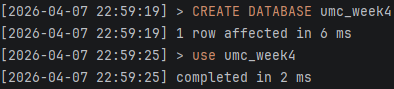

```sql
CREATE DATABASE umc_week4;
USE umc_week4;
```

### 확인 쿼리

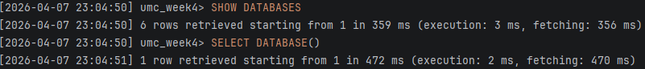

```sql
SHOW DATABASES;
SELECT DATABASE();
```

---

## 3. 테이블 생성

다음 주차 API 구현을 대비해서 기본 테이블을 생성했다.

이번에는 사용자, 지역, 가게, 미션, 사용자-미션 관계, 리뷰 테이블을 만들었다.

### 3-1. users 테이블

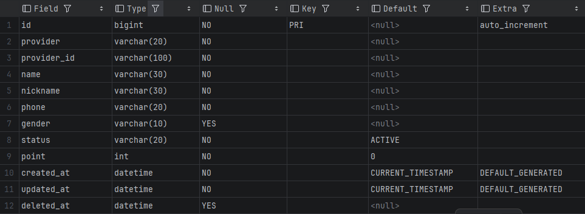

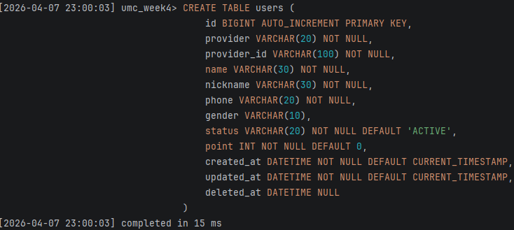

```sql
CREATETABLE users (
    id BIGINT AUTO_INCREMENTPRIMARYKEY,
    providerVARCHAR(20)NOTNULL,
    provider_idVARCHAR(100)NOTNULL,
    nameVARCHAR(30)NOTNULL,
    nicknameVARCHAR(30)NOTNULL,
    phoneVARCHAR(20)NOTNULL,
    genderVARCHAR(10),
    statusVARCHAR(20)NOTNULLDEFAULT'ACTIVE',
    pointINTNOTNULLDEFAULT0,
    created_at DATETIMENOTNULLDEFAULTCURRENT_TIMESTAMP,
    updated_at DATETIMENOTNULLDEFAULTCURRENT_TIMESTAMP,
    deleted_at DATETIMENULL
);
```

### 3-2. regions 테이블

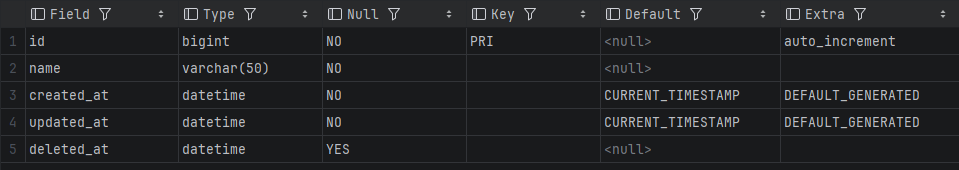
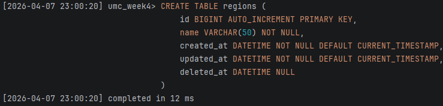

```sql
CREATETABLE regions (
    id BIGINT AUTO_INCREMENTPRIMARYKEY,
    nameVARCHAR(50)NOTNULL,
    created_at DATETIMENOTNULLDEFAULTCURRENT_TIMESTAMP,
    updated_at DATETIMENOTNULLDEFAULTCURRENT_TIMESTAMP,
    deleted_at DATETIMENULL
);
```

### 3-3. stores 테이블

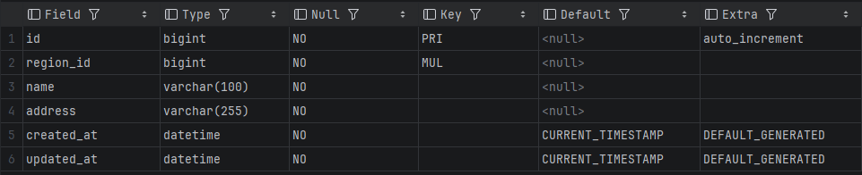

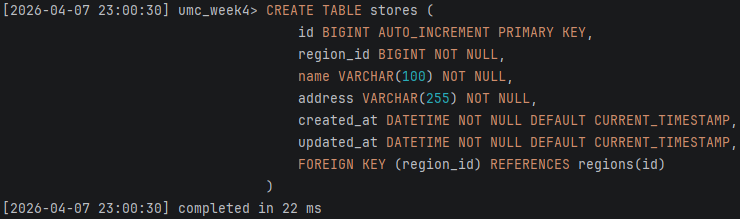

```sql
CREATETABLE stores (
    id BIGINT AUTO_INCREMENTPRIMARYKEY,
    region_id BIGINTNOTNULL,
    nameVARCHAR(100)NOTNULL,
    addressVARCHAR(255)NOTNULL,
    created_at DATETIMENOTNULLDEFAULTCURRENT_TIMESTAMP,
    updated_at DATETIMENOTNULLDEFAULTCURRENT_TIMESTAMP,
FOREIGNKEY (region_id)REFERENCES regions(id)
);
```

### 3-4. missions 테이블

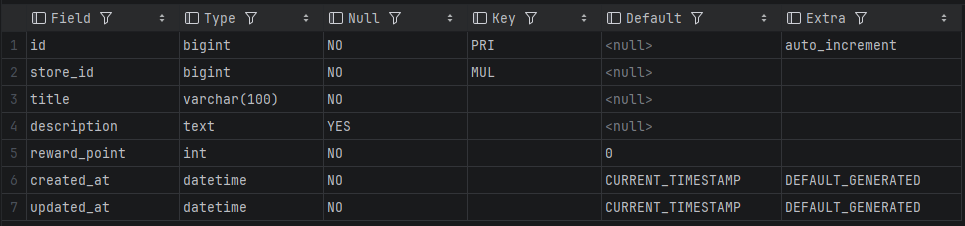


```sql
CREATETABLE missions (
    id BIGINT AUTO_INCREMENTPRIMARYKEY,
    store_id BIGINTNOTNULL,
    titleVARCHAR(100)NOTNULL,
    description TEXT,
    reward_pointINTNOTNULLDEFAULT0,
    created_at DATETIMENOTNULLDEFAULTCURRENT_TIMESTAMP,
    updated_at DATETIMENOTNULLDEFAULTCURRENT_TIMESTAMP,
FOREIGNKEY (store_id)REFERENCES stores(id)
);
```

### 3-5. user_missions 테이블

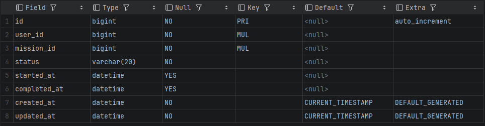

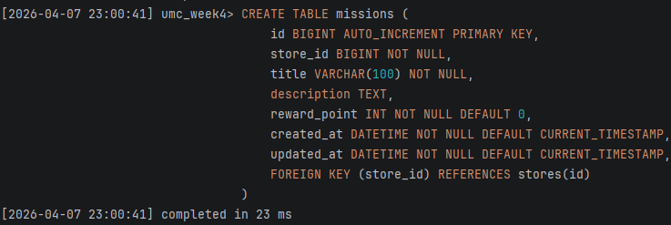

```sql
CREATETABLE user_missions (
    id BIGINT AUTO_INCREMENTPRIMARYKEY,
    user_id BIGINTNOTNULL,
    mission_id BIGINTNOTNULL,
    statusVARCHAR(20)NOTNULL,
    started_at DATETIMENULL,
    completed_at DATETIMENULL,
    created_at DATETIMENOTNULLDEFAULTCURRENT_TIMESTAMP,
    updated_at DATETIMENOTNULLDEFAULTCURRENT_TIMESTAMP,
FOREIGNKEY (user_id)REFERENCES users(id),
FOREIGNKEY (mission_id)REFERENCES missions(id)
);
```

### 3-6. reviews 테이블

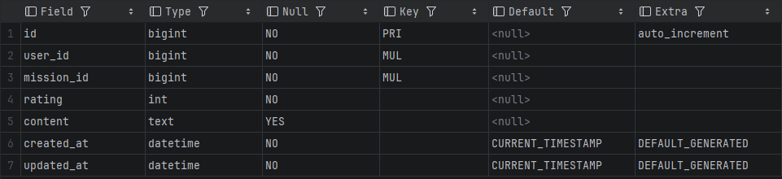

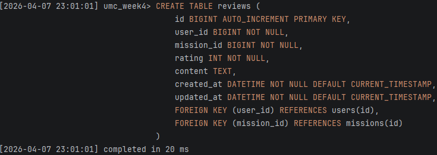

```sql
CREATETABLE reviews (
    id BIGINT AUTO_INCREMENTPRIMARYKEY,
    user_id BIGINTNOTNULL,
    mission_id BIGINTNOTNULL,
    ratingINTNOTNULL,
    content TEXT,
    created_at DATETIMENOTNULLDEFAULTCURRENT_TIMESTAMP,
    updated_at DATETIMENOTNULLDEFAULTCURRENT_TIMESTAMP,
FOREIGNKEY (user_id)REFERENCES users(id),
FOREIGNKEY (mission_id)REFERENCES missions(id)
);
```

---

## 4. 테이블 생성 확인

테이블이 잘 생성되었는지 확인하기 위해 아래 쿼리를 실행했다.

```
SHOW TABLES;
```

### 확인 결과

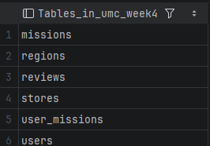

생성된 테이블 목록

- users
- regions
- stores
- missions
- user_missions
- reviews

또한 컬럼 구조를 확인하기 위해 `DESC` 명령도 사용했다.

```
DESC users;
DESC regions;
DESC stores;
DESC missions;
DESC user_missions;
DESC reviews;
```

## 5. 중간 과정에서 확인한 점

이번 미션을 하면서 가장 중요하게 생각한 부분은 결과만 확인하는 것이 아니라,

DB 생성 → DB 선택 → 테이블 생성 → 테이블 구조 확인

순서가 잘 드러나도록 기록하는 것이었다.

특히 외래키가 있는 테이블은 참조하는 테이블이 먼저 생성되어 있어야 하기 때문에,

`users`, `regions`를 먼저 만들고 그다음 `stores`, `missions`, `user_missions`, `reviews` 순서로 생성했다.

이 과정에서 테이블 생성 순서도 중요하다는 점을 다시 확인할 수 있었다.

---

## 6. 느낀 점

이번 공통 미션은 단순히 로컬 DB를 만드는 작업처럼 보였지만,

다음 주차 API 구현과 서버 프로젝트 진행을 위한 기초를 직접 준비하는 과정이라는 점에서 의미가 있었다.

특히 DataGrip으로 로컬 DB를 연결하고, 직접 쿼리로 데이터베이스와 테이블을 생성해보면서

앞으로 서버 개발에서는 코드만이 아니라 DB 구조와 연결 과정도 같이 다뤄야 한다는 걸 다시 느꼈다.