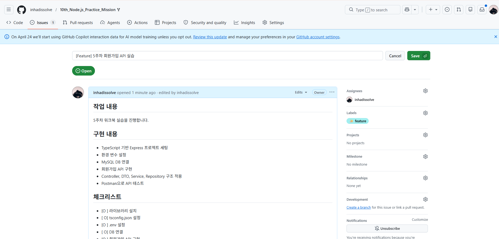
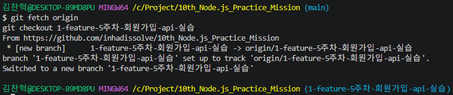
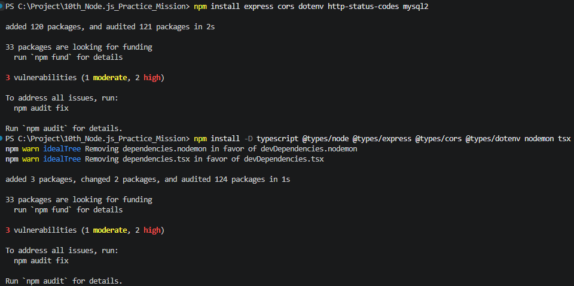
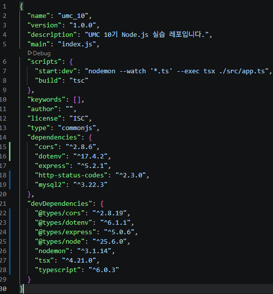
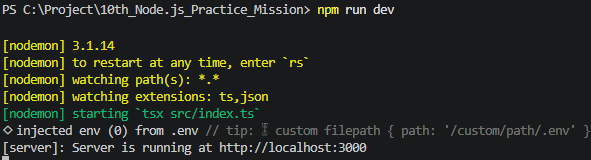
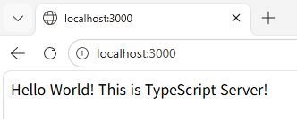
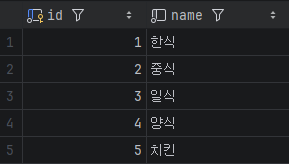
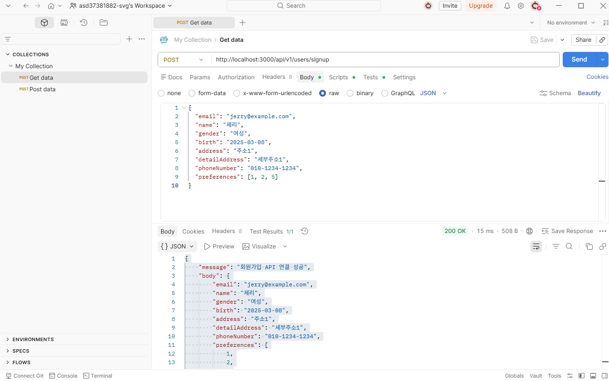
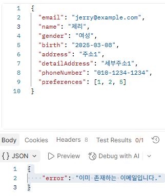

# 5주차 실습 정리

이번 5주차 실습에서는 TypeScript 기반 Express 프로젝트를 세팅하고, MySQL DB와 연결한 뒤 회원가입 API를 구현해보았다.  
또 Postman을 이용해 API를 직접 호출하고, DB에 데이터가 저장되는지 확인했다.

이번 실습은 결과 화면만 남기는 것보다, 프로젝트 세팅부터 API 테스트까지의 과정이 순차적으로 드러나도록 정리하는 것이 중요하다고 생각했다.

---

## 1. 실습 목표

이번 실습의 목표는 다음과 같다.

- GitHub Issue 생성 및 브랜치 생성 흐름 익히기
- TypeScript 기반 Express 프로젝트 세팅하기
- 환경 변수 설정하기
- MySQL DB 연결하기
- Controller, DTO, Service, Repository 구조 이해하기
- 회원가입 API 구현하기
- Postman 또는 curl로 API 테스트하기
- DB에 데이터가 실제로 저장되는지 확인하기

---

## 2. GitHub Issue와 브랜치 생성

API 구현 전 GitHub Issue를 먼저 생성했다.  
이번 주차부터는 기능 구현 전에 이슈를 만들고, 해당 이슈를 기준으로 브랜치를 생성하는 흐름을 연습했다.

### 생성한 Issue

```text
[Feature] 5주차 회원가입 API 구현
```

### 생성한 Branch

```text
feature/chapter-05
```

### 진행 이유

main 브랜치에서 바로 작업하지 않고 기능별 브랜치를 만들어 작업하면, 어떤 작업이 어떤 이유로 진행되었는지 추적하기 쉽다.  
또 PR을 통해 작업 내용을 검토하고 병합할 수 있어서 협업에 더 적합하다고 느꼈다.

### 첨부 이미지
- GitHub Issue 생성 화면


- feature/chapter-05 브랜치 생성 화면



---

## 3. 라이브러리 설치

이번 주차부터 TypeScript를 사용하기 때문에 필요한 라이브러리와 타입 정의 파일을 설치했다.

### 운영 환경 라이브러리

```bash
npm install express cors dotenv http-status-codes mysql2
```

### 개발 환경 라이브러리

```bash
npm install -D typescript @types/node @types/express @types/cors @types/dotenv nodemon tsx
```

### 주요 라이브러리 역할

| 라이브러리 | 역할 |
| --- | --- |
| express | API 서버 구현 |
| cors | CORS 허용 |
| dotenv | 환경 변수 사용 |
| http-status-codes | HTTP 상태 코드 상수 사용 |
| mysql2 | MySQL 연결 |
| typescript | TypeScript 사용 |
| tsx | TypeScript 파일 즉시 실행 |
| nodemon | 서버 자동 재시작 |

### 첨부 이미지
- 라이브러리 설치 터미널 화면

- package.json 확인 화면



---

## 4. TypeScript 설정

`npx tsc --init` 명령어로 `tsconfig.json` 파일을 생성했다.  
이 파일은 TypeScript 프로젝트의 설정을 관리하는 파일이다.

### 주요 설정

```json
{
  "compilerOptions": {
    "rootDir": "./src",
    "outDir": "./dist",
    "target": "ESNext",
    "module": "NodeNext",
    "moduleResolution": "NodeNext",
    "lib": ["ESNext"],
    "strict": true,
    "noUncheckedIndexedAccess": true,
    "skipLibCheck": true,
    "esModuleInterop": true,
    "forceConsistentCasingInFileNames": true,
    "sourceMap": true
  },
  "include": ["src/**/*"],
  "exclude": ["node_modules", "dist"]
}
```

### 느낀 점

`strict: true` 설정을 통해 TypeScript의 타입 검사를 더 엄격하게 적용할 수 있었다.  
처음에는 설정이 복잡해 보였지만, 결국 TypeScript가 프로젝트를 어떻게 검사할지 정하는 파일이라고 이해했다.

---

## 5. 환경 변수 설정

프로젝트 최상단에 `.env` 파일을 만들고 DB 정보와 서버 포트를 관리했다.

### `.env`

```env
DB_HOST=localhost
DB_PORT=3306
DB_USER=root
DB_PASSWORD=비밀번호
DB_NAME=umc_week5
PORT=3000
```

### `.gitignore`

```gitignore
node_modules/
.env
.env.*
```

### 느낀 점

DB 비밀번호 같은 민감한 정보는 코드에 직접 적지 않고 환경 변수로 관리해야 한다.  
또 `.env` 파일은 GitHub에 올라가면 안 되기 때문에 `.gitignore` 설정을 반드시 확인해야 한다.

---

## 6. Express 서버 세팅

`src/index.ts` 파일을 생성하고 Express 서버를 설정했다.

### 주요 코드

```ts
import dotenv from "dotenv";
import express, { Express, Request, Response } from "express";
import cors from "cors";

dotenv.config();

const app: Express = express();
const port = process.env.PORT || 3000;

app.use(cors());
app.use(express.static("public"));
app.use(express.json());
app.use(express.urlencoded({ extended: false }));

app.get("/", (req: Request, res: Response) => {
  res.send("Hello World! This is TypeScript Server!");
});

app.listen(port, () => {
  console.log(`[server]: Server is running at http://localhost:${port}`);
});
```

### 실행 명령어

```bash
npm run dev
```

### 확인한 내용

브라우저에서 `http://localhost:3000`에 접속했을 때 서버가 정상적으로 실행되는 것을 확인했다.

### 첨부 이미지
- 서버 실행 터미널 화면
    

- 브라우저 Hello World 화면

    

---

## 7. DB 연결 설정

`src/db.config.ts` 파일을 만들고 MySQL Connection Pool을 설정했다.

### 주요 코드

```ts
import mysql from "mysql2/promise";
import dotenv from "dotenv";

dotenv.config();

export const pool = mysql.createPool({
  host: process.env.DB_HOST || "localhost",
  user: process.env.DB_USER || "root",
  port: parseInt(process.env.DB_PORT || "3306"),
  database: process.env.DB_NAME || "umc_week5",
  password: process.env.DB_PASSWORD || "password",
  waitForConnections: true,
  connectionLimit: 10,
  queueLimit: 0,
});
```

### 느낀 점

Connection Pool을 사용하면 DB 연결을 매번 새로 생성하지 않고 재사용할 수 있다.  
이를 통해 DB 연결을 더 효율적으로 관리할 수 있다고 이해했다.

---

## 8. 회원가입 API 구현

이번 실습에서는 회원가입 API를 구현했다.

### API 정보

| 항목 | 내용 |
| --- | --- |
| Method | POST |
| Endpoint | /api/v1/users/signup |
| Content-Type | application/json |

### 요청 Body

```json
{
  "email": "jerry@example.com",
  "name": "제리",
  "gender": "여성",
  "birth": "2025-03-08",
  "address": "주소1",
  "detailAddress": "세부주소1",
  "phoneNumber": "010-1234-1234",
  "preferences": [1, 2, 5]
}
```

---

## 9. Controller, DTO, Service, Repository 구조

회원가입 API는 아래 흐름으로 동작하도록 구현했다.

1. 사용자가 Postman으로 회원가입 요청을 보낸다.
2. `index.ts`에서 `/api/v1/users/signup` 경로로 요청을 받는다.
3. Controller가 요청 body를 확인한다.
4. DTO가 요청 데이터를 정리한다.
5. Service가 회원가입 로직을 처리한다.
6. Repository가 DB에 SQL을 실행한다.
7. 결과가 다시 Controller를 거쳐 응답으로 반환된다.

### Controller

요청을 받고 Service를 호출한 뒤 응답을 반환한다.

### DTO

요청 데이터를 정리하고 변환한다.

### Service

이메일 중복 확인, 사용자 저장, 선호 카테고리 연결 같은 실제 로직을 처리한다.

### Repository

DB에 직접 접근해 SQL을 실행한다.

---

## 10. DB 테이블 생성

회원가입 API 테스트를 위해 아래 테이블을 생성했다.

- user
- food_category
- user_favor_category

### user 테이블

```sql
CREATE TABLE user (
  id INT AUTO_INCREMENT PRIMARY KEY,
  email VARCHAR(255) NOT NULL UNIQUE,
  name VARCHAR(100) NOT NULL,
  gender ENUM('남성', '여성') NOT NULL,
  birth DATE NOT NULL,
  address VARCHAR(255),
  detail_address VARCHAR(255),
  phone_number VARCHAR(20)
);
```

### food_category 테이블

```sql
CREATE TABLE food_category (
  id INT AUTO_INCREMENT PRIMARY KEY,
  name VARCHAR(50) NOT NULL
);
```

### user_favor_category 테이블

```sql
CREATE TABLE user_favor_category (
  id INT AUTO_INCREMENT PRIMARY KEY,
  user_id INT,
  food_category_id INT,
  FOREIGN KEY (user_id) REFERENCES user(id),
  FOREIGN KEY (food_category_id) REFERENCES food_category(id)
);
```

### food_category 더미 데이터

회원가입 요청의 `preferences` 값을 테스트하기 위해 food_category에 더미 데이터를 추가했다.

```sql
INSERT INTO food_category (name)
VALUES ('한식'), ('중식'), ('일식'), ('양식'), ('치킨');
```

### 첨부 이미지

- SHOW TABLES 결과 화면


---

## 11. Postman 테스트

Postman을 이용해 회원가입 API를 테스트했다.

### 성공 케이스

정상적인 요청 데이터를 넣었을 때 200 응답이 반환되었고, DB에도 데이터가 저장되는 것을 확인했다.

### 첨부 이미지

- Postman 성공 응답 화면



### 실패 케이스

같은 이메일로 다시 요청했을 때 중복 이메일 오류가 발생했다.  
이는 user 테이블의 email 컬럼에 UNIQUE 제약 조건이 있기 때문이다.

### 첨부 이미지



- 중복 이메일 요청 실패 화면
- 터미널 에러 로그 화면

---

## 12. curl 테스트

Postman과 같은 요청을 curl로도 테스트했다.

### 요청 예시

```bash
curl -X POST "http://localhost:3000/api/v1/users/signup" \
  -H "content-type: application/json" \
  -d '{
  "email": "test@example.com",
  "name": "엘빈",
  "gender": "남성",
  "birth": "2000-02-03",
  "address": "주소1",
  "detailAddress": "세부주소1",
  "phoneNumber": "010-1234-1234",
  "preferences": [1, 2, 5]
}'
```

### 확인한 내용

Postman뿐 아니라 터미널에서도 API 요청을 보낼 수 있다는 것을 확인했다.  
실제 개발이나 배포 환경에서는 curl도 자주 쓰일 수 있기 때문에 익숙해질 필요가 있다고 느꼈다.

---
