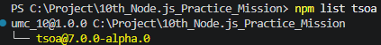
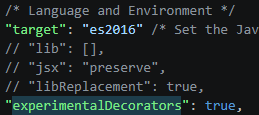
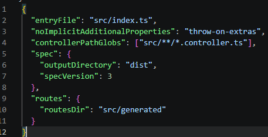
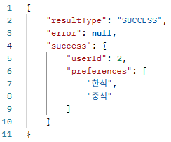
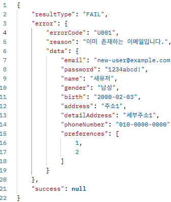
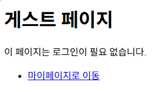
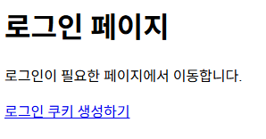
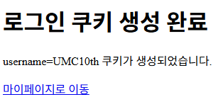
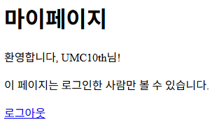
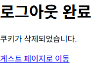

# 7주차 실습 README

이번 7주차 실습에서는 기존 Express 프로젝트에 Tsoa를 적용하고, Express 미들웨어와 API 응답 통일, 에러 핸들링 구조를 적용했다.

6주차까지는 Prisma ORM을 이용해 API 기능 구현에 집중했다면, 7주차에서는 API 구조를 더 일관성 있게 만들기 위해 다음 내용을 순차적으로 진행했다.

- Tsoa 적용
- Express 미들웨어 적용
- morgan, cookie-parser 적용
- 성공 응답 형식 통일
- 실패 응답 형식 통일
- 커스텀 Error 객체 적용
- 전역 에러 핸들러 적용
- Postman으로 성공/실패 응답 테스트

---

## 0. GitHub 작업 정보

### Issue

```text
[Practice] 7주차 Tsoa, 미들웨어, 응답 통일 실습
````

### Branch

```text
feature/chapter-07
```

### 작업 방식

이번 7주차 실습은 실습 코드와 README 정리가 함께 포함되므로 하나의 브랜치에서 진행했다.

커밋은 기능별로 분리했다.

```text
feat: 7주차 Tsoa 및 미들웨어 적용
docs: 7주차 실습 README 정리
docs: 7주차 미션 README 정리
```

### 브랜치 이동

```bash
cd C:\Project\10th_Node.js_Practice_Mission

git fetch origin
git switch feature/chapter-07
```

만약 브랜치가 로컬에 없다면 다음 명령어를 사용한다.

```bash
git switch -c feature/chapter-07 origin/feature/chapter-07
```

현재 브랜치 확인:

```bash
git branch
```

정상이라면 아래처럼 표시된다.

```text
* feature/chapter-07
```

---

## 1. 실습 전 현재 상태 확인

먼저 현재 프로젝트 상태를 확인했다.

```bash
git status
```

올라가면 안 되는 파일이 있는지 확인한다.

```text
.env
node_modules/
dist/
```

위 파일들은 GitHub에 올라가면 안 되므로 `.gitignore`에 포함되어 있어야 한다.

`.gitignore` 확인:

```gitignore
node_modules/
.env
.env.*
dist/
src/generated/prisma/
```

---

## 2. Tsoa 설치

### 2-1. 설치 명령어

```bash
npm install express tsoa
```

설치 중 다음과 같은 경고가 나올 수 있다.

```text
npm warn deprecated glob@10.5.0
3 vulnerabilities
```

### 2-2. 로그 해석

이 경고는 설치 실패가 아니라, 하위 의존성 중 일부 패키지에서 deprecated 또는 보안 취약점 경고가 발생했다는 의미이다.

설치 자체는 아래처럼 완료되면 성공이다.

```text
added ... packages
audited ... packages
```

### 2-3. 설치 확인

```bash
npm list tsoa
npm list express
```

또는 Tsoa 버전 확인:

```bash
npx tsoa --version
```

### 실습 인증 사진




---

## 3. tsconfig.json 수정

Tsoa는 데코레이터 문법을 사용하므로 `tsconfig.json`에 아래 옵션을 추가한다.

```json
{
  "compilerOptions": {
    "experimentalDecorators": true
  }
}
```

이미 `compilerOptions`가 있다면 그 안에 `"experimentalDecorators": true`만 추가하면 된다.

### 예시

```json
{
  "compilerOptions": {
    "target": "ES2022",
    "module": "NodeNext",
    "moduleResolution": "NodeNext",
    "strict": true,
    "esModuleInterop": true,
    "experimentalDecorators": true,
    "outDir": "./dist"
  }
}
```

### 왜 필요한가?

`@Route`, `@Post`, `@Get`, `@Tags` 같은 Tsoa 데코레이터를 사용하기 위해 필요하다.

### 실습 인증 사진




---

## 4. tsoa.json 생성

프로젝트 루트에 `tsoa.json` 파일을 생성한다.

```text
10th_Node.js_Practice_Mission
└── tsoa.json
```

내용은 다음과 같이 작성한다.

```json
{
  "entryFile": "src/index.ts",
  "noImplicitAdditionalProperties": "throw-on-extras",
  "controllerPathGlobs": ["src/**/*.controller.ts"],
  "spec": {
    "outputDirectory": "dist",
    "specVersion": 3
  },
  "routes": {
    "routesDir": "src/generated"
  }
}
```

### 설정 설명

| 설정                               | 의미                          |
| -------------------------------- | --------------------------- |
| `entryFile`                      | Express 서버의 진입 파일           |
| `controllerPathGlobs`            | Tsoa가 controller 파일을 찾는 경로  |
| `noImplicitAdditionalProperties` | DTO에 없는 추가 필드가 들어왔을 때 에러 처리 |
| `spec.outputDirectory`           | OpenAPI 문서 생성 위치            |
| `routes.routesDir`               | 자동 생성되는 routes.ts 위치        |

### 실습 인증 사진




---

## 5. 공통 응답 폴더 생성

성공 응답 구조를 통일하기 위해 공통 응답 파일을 만든다.

### 폴더 생성

```bash
mkdir -p src/common/responses
```

PowerShell에서는 다음처럼 해도 된다.

```powershell
mkdir src\common\responses
```

### 파일 생성

```text
src/common/responses/response.ts
```

### response.ts 작성

```ts
export interface ApiResponse<T> {
  resultType: "SUCCESS";
  error: null;
  success: T;
}

export const success = <T>(data: T): ApiResponse<T> => ({
  resultType: "SUCCESS",
  error: null,
  success: data,
});
```

### 코드 설명

```ts
resultType: "SUCCESS"
```

요청이 성공했음을 나타낸다.

```ts
error: null
```

성공 응답이므로 에러는 없다.

```ts
success: data
```

실제 응답 데이터는 `success` 안에 담는다.

---

## 6. 공통 Error 폴더 생성

실패 응답을 통일하기 위해 커스텀 Error 클래스를 만든다.

### 폴더 생성

```bash
mkdir -p src/common/errors
```

PowerShell:

```powershell
mkdir src\common\errors
```

---

## 7. AppError 생성

### 파일 생성

```text
src/common/errors/app.error.ts
```

### 코드 작성

```ts
export class AppError extends Error {
  public readonly errorCode: string;
  public readonly statusCode: number;
  public readonly data?: unknown;

  constructor(params: {
    errorCode: string;
    message: string;
    statusCode: number;
    data?: unknown;
  }) {
    super(params.message);

    this.errorCode = params.errorCode;
    this.statusCode = params.statusCode;
    this.data = params.data ?? null;
  }
}
```

### 코드 설명

기본 `Error` 객체는 주로 `message`만 가진다.
하지만 API 응답에서는 다음 정보가 필요하다.

```text
errorCode
statusCode
message
data
```

그래서 `AppError`를 만들어 공통 에러 구조를 정의했다.

---

## 8. 사용자 관련 커스텀 Error 생성

### 파일 생성

```text
src/common/errors/user.error.ts
```

### 코드 작성

```ts
import { AppError } from "./app.error.js";

export class DuplicateUserEmailError extends AppError {
  constructor(data?: unknown) {
    super({
      errorCode: "U001",
      message: "이미 존재하는 이메일입니다.",
      statusCode: 409,
      data,
    });
  }
}
```

### 코드 설명

```ts
errorCode: "U001"
```

이메일 중복 오류를 구분하기 위한 코드이다.

```ts
statusCode: 409
```

이미 존재하는 이메일은 기존 리소스 상태와 충돌하는 상황이므로 `409 Conflict`로 처리했다.

---

## 9. User DTO 정리

Tsoa에서는 Controller에서 요청/응답 타입을 직접 사용하므로 DTO를 인터페이스 중심으로 정리한다.

### 파일 위치

```text
src/modules/users/dtos/user.dto.ts
```

### 코드 예시

```ts
export interface UserSignUpRequest {
  email: string;
  password?: string;
  name: string;
  gender: string;
  birth: Date | string;
  address?: string;
  detailAddress?: string;
  phoneNumber: string;
  preferences: number[];
}

export interface UserSignUpResponse {
  userId: number;
  preferences: string[];
}
```

### 정리

기존에 `bodyToUser()` 같은 변환 함수가 있었다면, Tsoa 방식에서는 Controller에서 `@Body()`로 직접 타입을 받기 때문에 DTO는 요청과 응답의 타입 정의 중심으로 정리한다.

---

## 10. User Service 수정

이메일 중복 오류가 발생할 때 일반 Error가 아니라 커스텀 Error를 던지도록 수정한다.

### 파일 위치

```text
src/modules/users/services/user.service.ts
```

### 코드 예시

```ts
import { UserSignUpRequest, UserSignUpResponse } from "../dtos/user.dto.js";
import {
  addUser,
  getUser,
  getUserPreferencesByUserId,
  setPreference,
} from "../repositories/user.repository.js";
import { DuplicateUserEmailError } from "../../../common/errors/user.error.js";

export const userSignUp = async (
  data: UserSignUpRequest
): Promise<UserSignUpResponse> => {
  const joinUserId = await addUser({
    email: data.email,
    password: data.password,
    name: data.name,
    gender: data.gender,
    birth: new Date(data.birth),
    address: data.address ?? "",
    detailAddress: data.detailAddress ?? "",
    phoneNumber: data.phoneNumber,
  });

  if (joinUserId === null) {
    throw new DuplicateUserEmailError(data);
  }

  for (const preference of data.preferences) {
    await setPreference(joinUserId, preference);
  }

  const user = await getUser(joinUserId);

  const preferences = (await getUserPreferencesByUserId(joinUserId)).map(
    (obj) => obj.foodCategory.name
  );

  return {
    userId: user.id,
    preferences,
  };
};
```

### 변경 전

```ts
throw new Error("이미 존재하는 이메일입니다.");
```

### 변경 후

```ts
throw new DuplicateUserEmailError(data);
```

---

## 11. User Controller를 Tsoa 방식으로 변경

기존 Express 함수형 컨트롤러를 Tsoa 클래스 기반 컨트롤러로 변경한다.

### 파일 위치

```text
src/modules/users/controllers/user.controller.ts
```

### 기존 방식

```ts
export const handleUserSignUp = async (req, res, next) => {
  const user = await userSignUp(req.body);

  res.status(200).json({
    result: user,
  });
};
```

### Tsoa 방식

```ts
import { Body, Controller, Post, Route, Tags } from "tsoa";
import { UserSignUpRequest, UserSignUpResponse } from "../dtos/user.dto.js";
import { userSignUp } from "../services/user.service.js";
import { ApiResponse, success } from "../../../common/responses/response.js";

@Route("users")
@Tags("Users")
export class UserController extends Controller {
  @Post("signup")
  public async handleUserSignUp(
    @Body() body: UserSignUpRequest
  ): Promise<ApiResponse<UserSignUpResponse>> {
    console.log("회원가입을 요청했습니다!");
    console.log("body:", body);

    const user = await userSignUp(body);

    return success(user);
  }
}
```

### 코드 설명

```ts
@Route("users")
```

이 컨트롤러의 기본 경로를 의미한다.
최종적으로 `/api/v1/users`로 연결된다.

```ts
@Post("signup")
```

`POST /users/signup` 엔드포인트를 의미한다.

```ts
@Body() body: UserSignUpRequest
```

요청 body를 `UserSignUpRequest` 타입으로 받는다.

```ts
return success(user);
```

성공 응답을 공통 응답 형식으로 감싸서 반환한다.

---

## 12. Tsoa routes 생성

컨트롤러를 Tsoa 방식으로 수정한 뒤 routes 파일을 생성한다.

```bash
npx tsoa spec-and-routes
```

정상적으로 생성되면 아래 파일이 생긴다.

```text
src/generated/routes.ts
```

### 확인

```bash
ls src/generated
```

PowerShell:

```powershell
dir src\generated
```

### 실습 인증 사진

```md

```

---

## 13. index.ts에 Tsoa routes 연결

### 파일 위치

```text
src/index.ts
```

기존에는 `index.ts`에서 직접 라우트를 등록했다.

```ts
app.post("/api/v1/users/signup", handleUserSignUp);
```

이제 Tsoa가 생성한 routes를 연결한다.

### index.ts 예시

```ts
import dotenv from "dotenv";
import express, { Express, NextFunction, Request, Response } from "express";
import cors from "cors";
import { RegisterRoutes } from "./generated/routes.js";
import { AppError } from "./common/errors/app.error.js";

dotenv.config();

const app: Express = express();
const port = process.env.PORT || 3000;

app.use(cors());
app.use(express.static("public"));
app.use(express.json());
app.use(express.urlencoded({ extended: false }));

const router = express.Router();

RegisterRoutes(router);

app.use("/api/v1", router);

app.use((err: AppError, req: Request, res: Response, next: NextFunction) => {
  if (res.headersSent) {
    return next(err);
  }

  res.status(err.statusCode || 500).json({
    resultType: "FAIL",
    error: {
      errorCode: err.errorCode || "UNKNOWN",
      reason: err.message || "서버 오류가 발생했습니다.",
      data: err.data || null,
    },
    success: null,
  });
});

app.listen(port, () => {
  console.log(`[server]: Server is running at http://localhost:${port}`);
});
```

### 중요한 순서

```ts
app.use(express.json());
app.use(express.urlencoded({ extended: false }));

RegisterRoutes(router);
app.use("/api/v1", router);

app.use((err, req, res, next) => {
  ...
});
```

전역 에러 핸들러는 routes 등록 이후에 위치해야 한다.

---

## 14. package.json scripts 수정

서버 실행 전 Tsoa routes를 자동 생성하도록 scripts를 수정한다.

### package.json

```json
{
  "scripts": {
    "start": "tsoa spec-and-routes && tsx src/index.ts",
    "dev": "tsoa spec-and-routes && nodemon --exec tsx src/index.ts"
  }
}
```

### 의미

```text
tsoa spec-and-routes
→ src/generated/routes.ts 생성
→ tsx src/index.ts 실행
```

이렇게 하면 컨트롤러 수정 후 routes 생성을 깜빡하는 문제를 줄일 수 있다.

---

## 15. 서버 실행 테스트

```bash
npm run dev
```

정상 실행 예시:

```text
[server]: Server is running at http://localhost:3000
```

### 실습 인증 사진

```md

```

---

## 16. Postman으로 회원가입 성공 응답 테스트

### Request

```text
POST http://localhost:3000/api/v1/users/signup
```

### Body

```json
{
  "email": "new-user@example.com",
  "password": "1234abcd!",
  "name": "새유저",
  "gender": "남성",
  "birth": "2000-02-03",
  "address": "주소1",
  "detailAddress": "세부주소1",
  "phoneNumber": "010-0000-0000",
  "preferences": [1, 2]
}
```

### 예상 Response

```json
{
  "resultType": "SUCCESS",
  "error": null,
  "success": {
    "userId": 2,
    "preferences": ["한식", "중식"]
  }
}
```

### 확인할 점

```text
resultType이 SUCCESS인지 확인
error가 null인지 확인
실제 데이터가 success 안에 들어가는지 확인
```

### 실습 인증 사진





---

## 17. Postman으로 중복 이메일 실패 응답 테스트

같은 이메일로 다시 요청을 보낸다.

### Request

```text
POST http://localhost:3000/api/v1/users/signup
```

### Body

```json
{
  "email": "new-user@example.com",
  "password": "1234abcd!",
  "name": "새유저",
  "gender": "남성",
  "birth": "2000-02-03",
  "address": "주소1",
  "detailAddress": "세부주소1",
  "phoneNumber": "010-0000-0000",
  "preferences": [1, 2]
}
```

### 예상 Response

```json
{
  "resultType": "FAIL",
  "error": {
    "errorCode": "U001",
    "reason": "이미 존재하는 이메일입니다.",
    "data": {
      "email": "new-user@example.com",
      "password": "1234abcd!",
      "name": "새유저",
      "gender": "남성",
      "birth": "2000-02-03",
      "address": "주소1",
      "detailAddress": "세부주소1",
      "phoneNumber": "010-0000-0000",
      "preferences": [1, 2]
    }
  },
  "success": null
}
```

### 확인할 점

```text
resultType이 FAIL인지 확인
errorCode가 U001인지 확인
reason이 이미 존재하는 이메일입니다.인지 확인
success가 null인지 확인
HTTP Status가 409인지 확인
```

### 실습 인증 사진





---

## 18. morgan 설치 및 적용

### 설치

```bash
npm install morgan
npm install -D @types/morgan
```

### index.ts 적용

```ts
import morgan from "morgan";

app.use(morgan("dev"));
```

`cors()` 아래, 라우터 등록 전에 작성한다.

```ts
app.use(cors());
app.use(morgan("dev"));
app.use(express.static("public"));
app.use(express.json());
app.use(express.urlencoded({ extended: false }));
```

### 확인

Postman으로 아무 API나 요청하면 터미널에 로그가 출력된다.

```text
POST /api/v1/users/signup 409 12.456 ms - 350
```

---

## 19. cookie-parser 설치 및 적용

### 설치

```bash
npm install cookie-parser
npm install -D @types/cookie-parser
```

### index.ts 적용

```ts
import cookieParser from "cookie-parser";

app.use(cookieParser());
```

적용 위치:

```ts
app.use(cors());
app.use(morgan("dev"));
app.use(cookieParser());
app.use(express.static("public"));
app.use(express.json());
app.use(express.urlencoded({ extended: false }));
```

---

## 20. 인증 미들웨어 생성

### 폴더 생성

```bash
mkdir -p src/common/middlewares
```

PowerShell:

```powershell
mkdir src\common\middlewares
```

### 파일 생성

```text
src/common/middlewares/auth.middleware.ts
```

### 코드 작성

```ts
import { Request, Response, NextFunction } from "express";

export function authorizeUser() {
  return async (req: Request, res: Response, next: NextFunction) => {
    const { username } = req.cookies;

    if (username) {
      console.log(`[인증 성공] ${username}님, 환영합니다.`);
      next();
    } else {
      console.log("[인증 실패] 로그인이 필요합니다.");

      res
        .status(401)
        .send(
          '<script>alert("로그인이 필요합니다!");location.href="/api/v1/users/login";</script>'
        );
    }
  };
}
```

### 코드 설명

```ts
const { username } = req.cookies;
```

`cookie-parser`를 통해 쿠키 값을 객체로 읽는다.

```ts
next();
```

로그인 쿠키가 있으면 다음 단계로 넘어간다.

```ts
res.status(401)
```

쿠키가 없으면 인증 실패로 처리한다.

---

## 21. Tsoa Controller에 인증 예제 추가

`src/modules/users/controllers/user.controller.ts`에 아래 import를 추가한다.

```ts
import {
  Body,
  Controller,
  Get,
  Middlewares,
  Post,
  Request,
  Route,
  Tags,
} from "tsoa";
import { Request as ExpressRequest } from "express";
import { authorizeUser } from "../../../common/middlewares/auth.middleware.js";
```

UserController 안에 아래 메서드들을 추가한다.

```ts
@Get("guest")
public async handleGuestPage(): Promise<string> {
  return `
    <h1>게스트 페이지</h1>
    <p>이 페이지는 로그인이 필요 없습니다.</p>
    <ul>
      <li><a href="/api/v1/users/mypage">마이페이지로 이동</a></li>
    </ul>
  `;
}

@Get("login")
public async handleLoginPage(): Promise<string> {
  return "<h1>로그인 페이지</h1><p>로그인이 필요한 페이지에서 이동합니다.</p>";
}

@Get("mypage")
@Middlewares(authorizeUser())
public async handleMypage(
  @Request() req: ExpressRequest
): Promise<string> {
  return `
    <h1>마이페이지</h1>
    <p>환영합니다, ${req.cookies.username}님!</p>
    <p>이 페이지는 로그인한 사람만 볼 수 있습니다.</p>
  `;
}

@Get("set-login")
public async handleSetLogin(
  @Request() req: ExpressRequest
): Promise<string> {
  req.res!.cookie("username", "UMC10th", { maxAge: 3600000 });

  return '로그인 쿠키 생성 완료! <a href="/api/v1/users/mypage">마이페이지로 이동</a>';
}

@Get("set-logout")
public async handleSetLogout(
  @Request() req: ExpressRequest
): Promise<string> {
  req.res!.clearCookie("username");

  return '로그아웃 완료! <a href="/api/v1/users/guest">게스트 페이지로 이동</a>';
}
```

---

## 22. routes 재생성 및 서버 재실행

Controller에 새로운 endpoint를 추가했으므로 routes를 다시 생성해야 한다.

```bash
npx tsoa spec-and-routes
```

또는 서버 실행 시 자동 생성되도록 했다면:

```bash
npm run dev
```

---

## 23. 브라우저로 인증 미들웨어 테스트

브라우저에서 아래 순서대로 접속한다.

### 1단계. 게스트 페이지 접속

```text
http://localhost:3000/api/v1/users/guest
```

### 2단계. 마이페이지 접속

```text
http://localhost:3000/api/v1/users/mypage
```

쿠키가 없으면 로그인 필요 alert가 뜨고 `/api/v1/users/login`으로 이동한다.

### 3단계. 로그인 쿠키 생성

```text
http://localhost:3000/api/v1/users/set-login
```

### 4단계. 다시 마이페이지 접속

```text
http://localhost:3000/api/v1/users/mypage
```

이번에는 정상적으로 마이페이지가 열린다.

### 5단계. 로그아웃

```text
http://localhost:3000/api/v1/users/set-logout
```

### 6단계. 다시 마이페이지 접속

```text
http://localhost:3000/api/v1/users/mypage
```

다시 로그인 필요 alert가 뜨면 성공이다.

### 실습 인증 사진









---

## 24. 실습 완료 후 최종 확인

### 서버 실행

```bash
npm run dev
```

### 확인해야 할 API

```text
POST /api/v1/users/signup
GET /api/v1/users/guest
GET /api/v1/users/login
GET /api/v1/users/mypage
GET /api/v1/users/set-login
GET /api/v1/users/set-logout
```

### 확인해야 할 내용

```text
[ ] Tsoa routes가 생성되는가?
[ ] 서버가 정상 실행되는가?
[ ] 회원가입 성공 응답이 SUCCESS 구조로 반환되는가?
[ ] 중복 이메일 실패 응답이 FAIL 구조로 반환되는가?
[ ] morgan 로그가 터미널에 찍히는가?
[ ] cookie-parser로 쿠키를 읽을 수 있는가?
[ ] 인증 미들웨어가 mypage 접근을 제어하는가?
```

---

## 25. 실습 중 발생한 이슈 정리

### 이슈 1. tsoa 설치 중 deprecated 및 vulnerabilities 경고 발생

#### 문제

```text
npm warn deprecated glob@10.5.0
3 vulnerabilities
```

#### 원인

`tsoa` 설치 과정에서 함께 설치되는 하위 의존성 중 일부 패키지에서 deprecated 경고와 보안 취약점 경고가 발생했다.

#### 해결

설치 자체는 정상 완료되었는지 먼저 확인했다.

```bash
npm list tsoa
npm list express
```

이후 취약점 상세 내용은 아래 명령어로 확인했다.

```bash
npm audit
```

`npm audit fix --force`는 major version 변경으로 프로젝트가 깨질 수 있으므로 바로 실행하지 않았다.

---

### 이슈 2. generated/routes.ts를 찾을 수 없음

#### 문제

```text
Cannot find module './generated/routes'
```

#### 원인

Tsoa routes 파일을 아직 생성하지 않았다.

#### 해결

```bash
npx tsoa spec-and-routes
```

또는 `package.json` scripts에 아래처럼 추가했다.

```json
"dev": "tsoa spec-and-routes && nodemon --exec tsx src/index.ts"
```

---

### 이슈 3. 데코레이터 오류 발생

#### 문제

`@Route`, `@Post` 같은 데코레이터 사용 시 TypeScript 오류가 발생했다.

#### 원인

`tsconfig.json`에 데코레이터 사용 설정이 없었다.

#### 해결

```json
"experimentalDecorators": true
```

---

### 이슈 4. 실패 응답이 UNKNOWN으로만 내려옴

#### 문제

```json
{
  "resultType": "FAIL",
  "error": {
    "errorCode": "UNKNOWN",
    "reason": "이미 존재하는 이메일입니다.",
    "data": null
  },
  "success": null
}
```

#### 원인

일반 `Error` 객체에는 `errorCode`, `statusCode`가 없기 때문이다.

#### 해결

`AppError`를 상속한 커스텀 Error를 만들고 Service에서 해당 Error를 던지도록 수정했다.

```ts
throw new DuplicateUserEmailError(data);
```

---

## 26. 실습 인증 체크리스트

아래 사진을 `practice/chapter07/images/`에 저장한다.

```text
[ ] practice-01-tsoa-install.png
[ ] practice-02-tsconfig.png
[ ] practice-03-tsoa-json.png
[ ] practice-04-generated-routes.png
[ ] practice-05-server-run.png
[ ] practice-06-signup-success.png
[ ] practice-07-signup-fail.png
[ ] practice-08-morgan-log.png
[ ] practice-09-guest-page.png
[ ] practice-10-login-required.png
[ ] practice-11-set-login.png
[ ] practice-12-mypage-success.png
[ ] practice-13-logout.png
```

---

## 27. Git commit 정리

### 실습 코드 커밋

```bash
git add src package.json package-lock.json tsconfig.json tsoa.json
git commit -m "feat: 7주차 Tsoa 및 미들웨어 적용"
```

### 실습 README 커밋

```bash
git add practice/chapter07/README.md
git add practice/chapter07/images/
git commit -m "docs: 7주차 실습 README 정리"
```

### Push

```bash
git push -u origin feature/chapter-07
```

---

## 28. 느낀 점

이번 실습을 통해 API는 단순히 기능이 동작하는 것뿐만 아니라, 응답 구조와 에러 처리 방식도 일관되게 관리해야 한다는 것을 느꼈다.

Tsoa를 적용하면서 컨트롤러에서 API 경로와 요청 타입, 응답 타입을 더 명확하게 표현할 수 있었다. 또한 `success()` wrapper와 `AppError`를 적용하면서 성공 응답과 실패 응답의 구조를 통일할 수 있었다.

`morgan`을 통해 요청 로그를 확인하고, `cookie-parser`와 인증 미들웨어를 통해 특정 라우트를 보호하는 흐름도 이해할 수 있었다.

이번 실습을 통해 Express의 미들웨어 구조가 단순 보조 기능이 아니라 서버 요청 처리 흐름의 핵심이라는 점을 알게 되었다.

````
