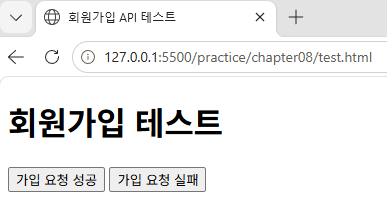
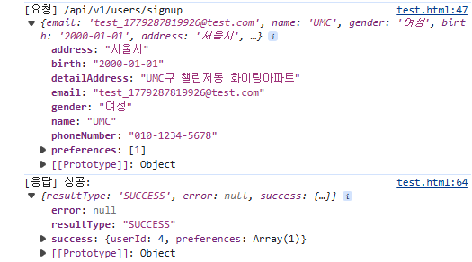
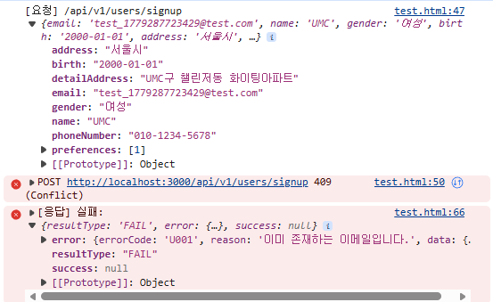
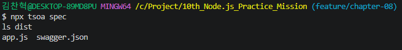
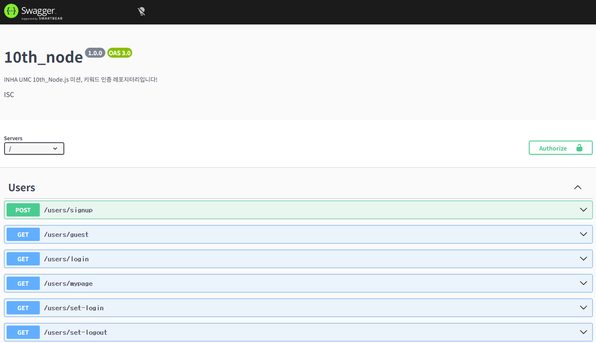
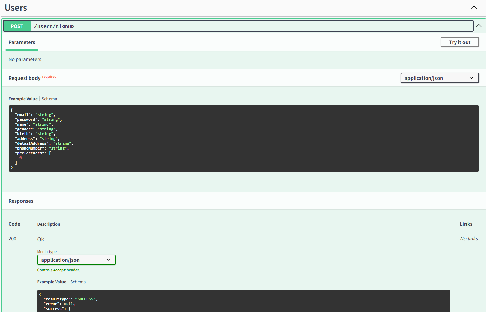

# 8주차 실습 README

## 1. 실습 목표

8주차 실습의 목표는 프론트엔드에서 백엔드 API를 직접 호출해보며 CORS 상황을 이해하고, Swagger UI를 통해 API 문서를 확인하는 것이다.

이번 실습에서는 다음 내용을 확인하였다.

- HTML 파일에서 백엔드 회원가입 API 호출
- 브라우저 개발자 도구 Console에서 성공/실패 응답 확인
- `swagger-ui-express`를 이용한 Swagger UI 연결
- TSOA가 생성한 `swagger.json` 기반 API 문서 확인

---

## 2. CORS 실습용 `test.html` 작성

프론트엔드에서 백엔드 API를 호출하는 상황을 확인하기 위해 `test.html` 파일을 작성하였다.

백엔드 서버는 `http://localhost:3000`에서 실행되고, `test.html`은 VSCode Live Server를 통해 다른 포트에서 실행된다.  
이를 통해 서로 다른 Origin에서 API를 호출하는 상황을 만들 수 있다.

```html
<!DOCTYPE html>
<html lang="ko">
<head>
  <meta charset="UTF-8" />
  <title>회원가입 API 테스트</title>
</head>
<body>
  <h1>회원가입 테스트</h1>

  <button id="signupSuccessButton">가입 요청 성공</button>
  <button id="signupFailButton">가입 요청 실패</button>

  <script>
    const API_URL = "http://localhost:3000";

    document.getElementById("signupSuccessButton").onclick = async () => {
      const userData = {
        email: `test_${Date.now()}@test.com`,
        name: "UMC",
        gender: "여성",
        birth: "2000-01-01",
        address: "서울시",
        detailAddress: "UMC구 챌린저동 화이팅아파트",
        phoneNumber: "010-1234-5678",
        preferences: [1]
      };

      await callAPI("/api/v1/users/signup", userData);
    };

    document.getElementById("signupFailButton").onclick = async () => {
      const userData = {
        email: "test@example.com",
        name: "UMC",
        gender: "여성",
        birth: "2000-01-01",
        address: "서울시",
        detailAddress: "UMC구 챌린저동 화이팅아파트",
        phoneNumber: "010-1234-5678",
        preferences: [1]
      };

      await callAPI("/api/v1/users/signup", userData);
    };

    async function callAPI(path, data) {
      console.log("[요청]", path, data);

      try {
        const response = await fetch(API_URL + path, {
          method: "POST",
          headers: {
            "Content-Type": "application/json"
          },
          body: JSON.stringify(data)
        });

        const responseData = await response.json();

        if (!response.ok) {
          throw responseData;
        }

        console.log("[응답] 성공:", responseData);
      } catch (error) {
        console.error("[응답] 실패:", error);
      }
    }
  </script>
</body>
</html>
```

---

## 3. Live Server로 실행

작성한 `test.html` 파일을 VSCode의 Live Server로 실행하였다.

실행 후 브라우저에서 아래와 같은 주소로 접속되었다.

```text
http://127.0.0.1:5500/practice/chapter08/test.html
```

백엔드 서버는 `http://localhost:3000`에서 실행 중이므로, 프론트엔드와 백엔드가 서로 다른 Origin에서 통신하는 상황이 된다.

### 실행 화면



---

## 4. 회원가입 API 성공 응답 확인

`가입 요청 성공` 버튼을 클릭하면 매번 새로운 이메일을 생성하여 회원가입 API를 호출한다.

```js
email: `test_${Date.now()}@test.com`
```

이 방식은 이메일 중복을 피하기 위해 사용하였다.

브라우저 개발자 도구의 Console에서 요청 데이터와 성공 응답을 확인할 수 있었다.

### 성공 응답 확인 화면



---

## 5. 회원가입 API 실패 응답 확인

`가입 요청 실패` 버튼을 클릭하면 이미 존재한다고 가정한 이메일로 회원가입 요청을 보낸다.

```js
email: "test@example.com"
```

이 요청은 중복 이메일 상황을 확인하기 위한 것이다.  
브라우저 개발자 도구의 Console에서 실패 응답을 확인할 수 있었다.

이를 통해 7주차에서 구현한 표준 에러 응답이 프론트엔드에서 어떻게 전달되는지 확인할 수 있었다.

### 실패 응답 확인 화면



---

## 6. Swagger UI 패키지 설치

Swagger UI를 Express 서버에서 확인하기 위해 다음 패키지를 설치하였다.

```bash
npm install swagger-ui-express
npm install --save-dev @types/swagger-ui-express
```

설치 후 `package.json`에 관련 의존성이 추가되었다.

---

## 7. TSOA Swagger 명세 생성

TSOA를 이용해 Swagger 명세 파일을 생성하였다.

```bash
npx tsoa spec
```

명령어 실행 후 `dist/swagger.json` 파일이 생성된다.

```text
dist/swagger.json
```

이 파일은 OpenAPI 형식으로 작성된 API 명세 파일이며, Swagger UI는 이 파일을 읽어서 API 문서를 화면에 보여준다.

### Swagger 명세 생성 화면



---

## 8. Swagger UI 연결

`src/index.ts`에서 TSOA가 생성한 `dist/swagger.json` 파일을 읽어 `/docs` 경로에 Swagger UI를 연결하였다.

```ts
import swaggerUi from "swagger-ui-express";
import path from "path";
import fs from "fs";

const swaggerFile = JSON.parse(
  fs.readFileSync(path.resolve("dist/swagger.json"), "utf8")
);

app.use("/docs", swaggerUi.serve, swaggerUi.setup(swaggerFile));
```

위 코드에서 `dist/swagger.json`을 읽어오고, `/docs` 경로에서 Swagger UI가 보이도록 설정하였다.

---

## 9. Swagger UI 확인

서버를 실행한 뒤 브라우저에서 아래 주소로 접속하였다.

```text
http://localhost:3000/docs
```

Swagger UI에서 현재 프로젝트의 API 목록을 확인할 수 있었다.

### Swagger UI 메인 화면



---

## 10. API 상세 문서 확인

Swagger UI에서 특정 API를 펼쳐 요청 Body, 응답 형식, 상태 코드 등을 확인하였다.

특히 회원가입 API의 경우 요청 Body에 필요한 필드와 성공/실패 응답을 확인할 수 있었다.

### API 상세 화면



---

## 11. 실습 정리

이번 실습을 통해 프론트엔드가 백엔드 API를 직접 호출할 때 어떤 방식으로 요청과 응답이 오가는지 확인할 수 있었다.

특히 `test.html`을 Live Server로 실행하여 백엔드 서버와 다른 Origin에서 API를 호출함으로써 CORS 상황을 직접 확인할 수 있었다. 또한 Swagger UI를 연결하면서 API 문서화가 프론트엔드와의 협업에서 중요하다는 점을 이해할 수 있었다.

---

## 12. 트러블슈팅

### 이슈 1. Swagger UI 실행 시 `dist/swagger.json` 파일을 찾을 수 없는 문제

#### 문제

Swagger UI 설정 코드에서 `dist/swagger.json` 파일을 읽도록 작성했지만, 아직 해당 파일이 생성되지 않은 경우 서버 실행 시 오류가 발생할 수 있다.

#### 해결

서버 실행 전에 아래 명령어를 먼저 실행하여 Swagger 명세 파일을 생성하였다.

```bash
npx tsoa spec
```

---

### 이슈 2. CORS 실습에서 API 요청이 실패하는 문제

#### 문제

`test.html`은 Live Server에서 실행되고 백엔드 서버는 `localhost:3000`에서 실행되기 때문에 서로 다른 Origin에서 요청이 발생한다.  
이때 서버에서 CORS 설정이 되어 있지 않으면 브라우저가 요청을 차단할 수 있다.

#### 해결

Express 서버에서 `cors` 미들웨어가 등록되어 있는지 확인하였다.

```ts
app.use(cors());
```

이를 통해 다른 Origin에서 들어오는 요청을 허용할 수 있었다.

---

## 13. 느낀 점

이번 실습을 통해 API는 단순히 백엔드에서 구현하는 것만으로 끝나는 것이 아니라, 프론트엔드가 실제로 호출하고 이해할 수 있어야 한다는 점을 알게 되었다.

CORS 실습을 통해 프론트엔드와 백엔드가 서로 다른 Origin에서 통신할 때 발생할 수 있는 문제를 확인할 수 있었고, Swagger UI를 통해 API 문서를 제공하면 협업 과정에서 요청 방식과 응답 구조를 훨씬 명확하게 공유할 수 있다는 점을 이해할 수 있었다.